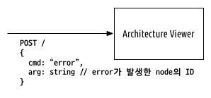
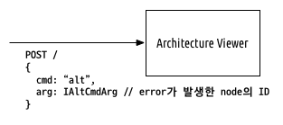

# Architecture Viewer (for Demo)
(based on [godepexplorer-viewer](https://github.com/byron1st/godepexplorer-viewer))

[](https://github.com/prettier/prettier)

[Electron](https://electronjs.org) 기반의 아키텍처 모델 뷰어.

## How to execute

### Prerequisites
* [node](https://nodejs.org/ko/) : LTS (8.11.2) 버전 설치 추천
* [yarn](https://yarnpkg.com/lang/en/) : Package manager로 npm 대신 yarn을 사용 중

### Initialization
```
git clone https://github.com/byron1st/arch-viewer-demo.git
cd arch-viewer-demo
yarn install
```

### Launch the app

`arch-viewer-demo` 디렉토리에서 다음 커맨드를 실행한다. 포트 `3030`에서 실행된다.

```
npm start
```

포트 값을 바꾸고 싶을 경우, `src/main/main.ts`의 다음 부분을 고친 다음 다시 `npm start`를 수행한다.

```typescript
// src/main/main.ts
...
import { Graph, ICommand } from 'godeptypes'

// Declare global variables
const CanvasIndexUrl = url.format({
  pathname: path.join(__dirname, '../canvas/index.html'),
  protocol: 'file:',
  slashes: true
})

const port = '3030' // <------------- 이 부분을 수정. (17 line)
...
```

### API
앱은 HTTP POST 리퀘스트로 json 데이터를 보내서 기능을 수행한다.
리퀘스트의 json 데이터는 공통적으로 아래 구조를 갖는다. `IAltCmdArg` 타입에 대한 자세한 정의는 대체 서비스 표시 이벤트 API 섹션에 있다.

```typescript
{
  cmd: 'error' | 'alt' // 'error' 또는 'alt'
  arg: string | IAltCmdArg // 'error'일 경우 string, 'alt'일 경우 IAltCmdArg 타입을 갖음
}
```

#### 에러 발생 이벤트 API



##### 에러 발생 이벤트 API의 `arg` 예제

```json
{
  "cmd": "error",
  "arg": "led-service"
}
```

#### 대체 서비스 표시 이벤트 API



대체 서비스 표시 이벤트 API를 호출하려면, `cmd` 값에 `'alt'` 값을, `arg` 값에 `IAltCmdArg` 타입의 객체를 할당해야 한다.
`IAltCmdArg` 타입은 아래와 같은 정의를 갖는다.

```typescript
{
  // target은 Graph에서 지워져야 할 node, edge들의 리스트를 포함한다.
  target: {
    nodes: INode[]
    edges: IEdge[]
  },
  // alternatives는 Graph에서 새롭게 추가되어야 할 node, edge들의 리스트를 포함한다.
  alternatives: {
    nodes: INode[]
    edges: IEdge[]
  }
}
```

`INode`의 구조는 다음과 같다.

```typescript
{
  id: string
  label: string
  type: 'cps' | 'comp' // 'cps'는 CPS 서비스를, 'comp'는 그 외 필수 컴포넌트를 의미함
  meta: {
    host: string
    location: string
    information: string
    sinkEdgeIDSet: { [id: string]: boolean }
    sourceEdgeIDSet: { [id: string]: boolean }
  }
}
```

`IEdge`의 구조는 다음과 같다.
```typescript
{
  id: string
  from: string
  to: string
  type: 'http' | 'local' // 'http' 또는 'local' 값
  meta: {
    dataType: string
    information: string
  }
}
```

##### 대체 서비스 표시 이벤트 API 주의사항

A -(E1)-> B

에서,

A -(E1')-> B' -(E2)-> C

로 변경하는 경우, `target` 에는 E1, B 정보가, `alternatives`에는 E1', B', E2, C 정보가 있어야 한다.

##### 대체 서비스 표시 이벤트 API의 `arg` 예제

```json
{
  "cmd": "alt",
  "arg": {
    "target": {
      "nodes": [
        {
          "id": "led-service",
          "label": "NAVER Weather Service",
          "type": "cps",
          "meta": {
            "host": "141.124.124.124",
            "location": "Naver Cloud Platform",
            "information": "Weather service, which is provided by NAVER",
            "sinkEdgeIDSet": {
              "cps-service-connector01": true
            },
            "sourceEdgeIDSet": {}
          }
        }
      ],
      "edges": [
        {
          "id": "cps-service-connector01",
          "from": "security-application",
          "to": "led-service",
          "type": "http",
          "meta": {
            "information": "Get weather",
            "dataType": "JSON-format1"
          }
        }
      ]
    },
    "alternatives": {
      "nodes": [
        {
          "id": "cps-service-weather-daum",
          "label": "DAUM Weather Service",
          "type": "cps",
          "meta": {
            "host": "141.124.124.124",
            "location": "Daum Cloud Platform",
            "information": "Weather service, which is provided by DAUM",
            "sinkEdgeIDSet": {
              "cps-service-connector01b": true
            },
            "sourceEdgeIDSet": {}
          }
        },
        {
          "id": "cps-service-weather-daum-adapter",
          "label": "DAUM Weather Service Adapter",
          "type": "cps",
          "meta": {
            "host": "141.124.154.235",
            "location": "Our Cloud Platform",
            "information": "Adapter service for DAUM",
            "sinkEdgeIDSet": {
              "cps-service-connector01a": true
            },
            "sourceEdgeIDSet": {
              "cps-service-connector01b": true
            }
          }
        }
      ],
      "edges": [
        {
          "id": "cps-service-connector01a",
          "from": "security-application",
          "to": "cps-service-weather-daum-adapter",
          "type": "http",
          "meta": {
            "information": "Get weather",
            "dataType": "JSON-format1"
          }
        },
        {
          "id": "cps-service-connector01b",
          "from": "cps-service-weather-daum-adapter",
          "to": "cps-service-weather-daum",
          "type": "http",
          "meta": {
            "information": "Get weather",
            "dataType": "JSON-format1"
          }
        }
      ]
    }
  }
}
```

### 초기 그래프 데이타

프로젝트 루트 폴더에 `initGraph.json` 이름의 파일을 넣어주면 된다. `initGraph.json` 파일은 다음 구조를 갖는다.

```typescript
{
  nodes: INode[]
  edges: IEdge[]
}
```

파일 이름을 수정하려면, `src/main/main.ts`의 다음 부분을 수정해주면 된다.

```typescript
    const server = http.createServer(requestHandler)
    server.listen(port)

    // <------------------ initGraph.json 파일 명을 수정하면 된다. (97 line)
    const initGraph = JSON.parse(fs.readFileSync(path.join(__dirname, '../../initGraph.json')).toString())
    createCanvasWindow(initGraph)
```

# License

MIT license
